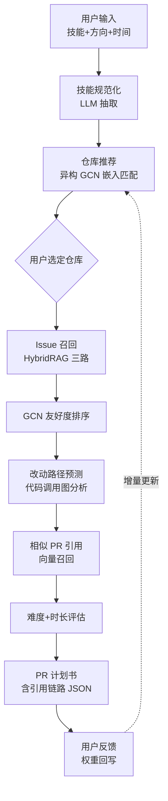
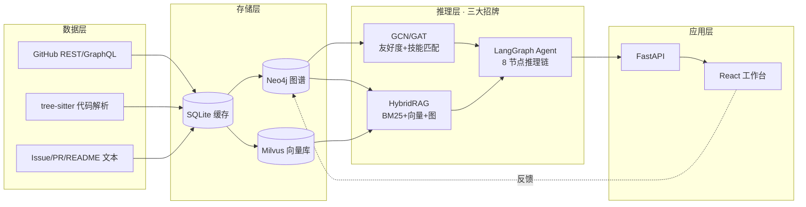

# OpenSourceCopilot · 选题方案

> 课程：基于 AI 的知识管理 · 小组项目
> 工作区目录：`CaseGraphCopilot`（保留命名，不影响项目语义）
> 项目代号：`OpenSourceCopilot` / `os-copilot`

---

## 1 · 问题场景

### 1.1 谁在受困

| 角色 | 现状 | 数据支撑 |
|---|---|---|
| 开源新人 | 想贡献但找不到入口；70% 卡在"读 README 看不出门道" | 2024 GitHub Octoverse: 仅 14% 注册者有 ≥1 commit |
| 开源维护者 | `good-first-issue` 靠人工打标，覆盖率低 | LangChain / Vue 等大仓 Issue 堆积超 1k |
| 企业内部 | 新人 onboarding 周期 3–6 周 | 国内大厂普遍数据 |

### 1.2 一句话价值主张

> 输入「技能 + 兴趣方向 + 每周时间」→ 5 秒输出 **可执行的 PR 计划书**：仓库推荐、Issue 优先级、改动文件预测、类似 PR 引用、PR 模板，所有结论附**可点击的代码 / Issue / PR 引用链路**。

### 1.3 为什么这是"知识管理"问题

开源仓库本质是**沉淀了海量结构化（代码、PR）+ 非结构化（Issue、文档）知识**的资产，但**新人无法快速调用**——典型的"组织有知识但个人用不上"的 KM 困境。我们用 AI 把它结构化、可检索、可推理。

---

## 2 · 方案总流程



---

## 3 · 技术架构



---

## 4 · 五大技术模块

### 模块 1 · 知识图谱（课程第 3、5 章）

**本体（Ontology）**：

| 实体 | 关键属性 |
|---|---|
| `Repo` | name, stars, language, topic, license |
| `Module` | repo, path, type=(file/package) |
| `Function` | module, name, signature, docstring |
| `Issue` | repo, title, labels, state, comment_count |
| `PR` | repo, files_changed, merged, first_time_contributor |
| `Contributor` | login, contribution_count |
| `Skill` | name, family=(language/framework/domain) |

**核心关系**：
- `Module -CONTAINS-> Function`
- `Function -CALLS-> Function`
- `Issue -AFFECTS-> Module`
- `PR -MODIFIES-> Function`
- `PR -CLOSES-> Issue`
- `Contributor -AUTHORED-> PR`
- `Contributor -HAS_SKILL-> Skill`
- `Issue -REQUIRES-> Skill`

实现：`backend/app/kg/schema.py` + Neo4j 5.x。

### 模块 2 · GCN 图神经网络（课程第 4 章 · 招牌 ①）

**两个学习任务**：
1. **Issue 新手友好度二分类**
   - 节点：Issue
   - 特征：标签 one-hot / 描述长度 / 评论数 / 关联模块圈复杂度 / 历史 PR 平均行数
   - 标签：该 Issue 关闭它的 PR 是否首次贡献者作者（GitHub `author_association`）
   - 模型：2 层 GCN/GAT，BCE Loss
2. **Contributor × Repo 异构嵌入匹配**
   - 异构图：Contributor、Skill、Repo 三类节点
   - 模型：R-GCN 或 HAN
   - 在线推理：用户技能 → 嵌入 → ANN 最近邻 → Top-K 仓库

**为何必须用 GCN（答辩防守点）**：Issue 不是孤立的，它附着在代码模块依赖图上——纯文本分类丢失结构信号；Contributor 与 Repo 的匹配本质是异构图链接预测。
**Ablation 设计**：与 BERT 文本分类 + 余弦相似度基线对比 F1，写进报告。

实现：`backend/app/gcn/model.py` + `train.py`。

### 模块 3 · HybridRAG（课程第 7、9、10 章 · 招牌 ②）

**三路并行召回 → LLM 重排 → 带引用回答**：

| 路 | 引擎 | 用途 |
|---|---|---|
| 1 · BM25 | `rank-bm25` | Issue 标题/正文关键词 |
| 2 · 向量 | UniXcoder 嵌入代码 + BGE-zh 嵌入文档 | 语义相似 |
| 3 · 图 | Neo4j Cypher 邻接查询 | 实体抽取 → 子图扩展 |

**输出严格 schema**：
```json
{
  "answer": "...",
  "citations": [
    {"type": "code", "repo": "langchain", "file": "src/x.py", "lines": [42, 58]},
    {"type": "pr", "id": 1234, "url": "..."},
    {"type": "issue", "id": 567}
  ]
}
```

前端把每条引用渲染成可点击锚点，**可解释 + 可追溯**。

实现：`backend/app/rag/hybrid.py`。

### 模块 4 · LangGraph 多步 Agent（课程第 13 章 · 招牌 ③）

**8 节点 DAG**：

```
SkillExtractor → RepoMatcher(GCN) → IssueFinder(HybridRAG) → FriendlinessRanker(GCN)
  → PathPredictor(代码图) → SimilarPRRetriever → DifficultyEstimator → PRDrafter
```

每个节点：定义工具 + 输入输出 schema，错误可回退。
**关键设计**：保留每步中间结果可视化（演示时直接展示 Agent "思考链"，比单轮 QA 高一档）。

实现：`backend/app/agent/graph.py`。

### 模块 5 · 应用层（课程第 15 章）

- **后端**：FastAPI + Pydantic + httpx + GitHub API 限流缓存（SQLite）
- **前端**：React + Vite + TS + Cytoscape.js（图谱可视化，Week 4 接入）
- **三屏布局**：输入面板 / 推荐流 / 详情 + 引用链路高亮

---

## 5 · 课程要素映射表

| 课程章节 | 实现 | 充分性 |
|---|---|---|
| 第 3 章 KG 表示 | 7 类实体 + 8 类关系本体 | ✅ |
| 第 4 章 图计算（GCN） | 友好度分类 + 异构嵌入匹配 + ablation | ✅✅ 招牌 |
| 第 5 章 图数据库 | Neo4j + Cypher 查询 | ✅ |
| 第 7 章 向量数据库 | Milvus + 双嵌入空间 | ✅ |
| 第 9 章 知识增强 Prompt | 思维链 / Few-shot 模板 | ✅ |
| 第 10 章 知识增强 RAG | HybridRAG 三路召回 + 引用链 | ✅✅ 招牌 |
| 第 13 章 Agent 系统 | LangGraph 8 节点编排 | ✅✅ 招牌 |
| 第 15 章 应用 | 全栈 Web 工作台 | ✅ |

**8 个章节命中**，3 个深度强化。

---

## 6 · 4 周路线

| 周 | 主要交付 | 验收标准 |
|---|---|---|
| **W1** | 10 个种子仓库数据入 Neo4j + 100 Issue/PR | 图谱节点 ≥ 5k，Cypher 能跑通邻接查询 |
| **W2** | 向量库 + 基础 HybridRAG + FastAPI 骨架 | 给定查询能返回带引用的回答 |
| **W3** | GCN 训练 + Agent 编排 + 重排器 | GCN F1 ≥ 0.7，Agent 跑通端到端 |
| **W4** | React 前端 + demo 视频 + 报告 + PPT | demo 完整、PPT 30 页、答辩演练 ≥ 2 轮 |

---

## 7 · 成员分工

| 成员 | 标题 | 主负责模块 | 课程章节 | 报告章节 |
|---|---|---|---|---|
| A | Graph Scientist | GCN/GAT 训练 · 异构嵌入 · ablation 实验 | 第 4 章 | 技术组件 - GCN + 实验对比 |
| B | Retrieval Engineer | 向量库 · HybridRAG 三路召回 · 重排 · Prompt | 第 7/9/10 章 | 技术组件 - HybridRAG + 引用链路 |
| C | Agent Architect | LangGraph 编排 · 工具调用 · 思考链可视化 | 第 13 章 | 技术组件 - Agent + 流程图 |
| D | Full-stack & Data | GitHub ETL · Neo4j · FastAPI · React 前端 · 部署 | 第 3/5/15 章 | 问题场景 + 效果演示 + 整体架构 |

---

## 8 · 效果演示设计

### Demo 剧本（3 分钟视频 + 现场演示）

1. 输入："Python 中级，会 FastAPI 和一点 RAG，想给 LLM 应用框架做贡献，每周 5 小时"
2. 系统 5 秒返回：
   - **仓库 Top 3**：LangChain / LlamaIndex / Haystack（附 GCN 嵌入相似度）
3. 选定 LangChain → 自动跳出：
   - **Issue Top 3**（友好度 0.85 / 0.78 / 0.72）
   - 点开 #12345 → 改动文件预测 `libs/core/langchain_core/runnables/base.py`
   - 类似 PR #11000（已合并，作者首次贡献）→ 点击跳转
   - 难度 ★★☆ · 预估 4 小时 · 自动生成 PR 标题描述 checklist
4. 现场点击 Cytoscape 图谱可视化 → 高亮该 Issue 在仓库图中的位置

### 关键截图/数据准备清单

- [ ] GCN 训练 loss 曲线 + F1/Precision/Recall 表（含 BERT 基线 vs GCN ablation）
- [ ] HybridRAG 三路召回各自命中数对比柱状图
- [ ] Agent 端到端决策日志（每步思考过程）
- [ ] Neo4j 子图截图（10k+ 节点的视觉震撼）
- [ ] 前端三屏完整 GIF

---

## 9 · 风险与预案

| 风险 | 触发条件 | 预案 |
|---|---|---|
| GitHub API 限流 | 5k req/h 用完 | SQLite 全量缓存 + 多 token 轮询 |
| GCN 训练效果差 | F1 < 0.6 | 退化为 GraphSAGE → 再退化为规则评分 |
| HybridRAG 慢 | > 5 秒 | 缓存高频查询 + 异步并发召回 |
| Agent 不稳定 | LLM 偶发失败 | 规则版 if-else fallback 兜底，保 demo 不翻车 |
| 数据规模太大 | Neo4j OOM | 限定 5–10 个种子仓库，不贪大 |

---

## 10 · 差异化卖点（30 秒电梯演讲）

> 我们用**异构知识图谱**把开源仓库从"代码 + Issue + PR 散落的资产"重组为**可推理的知识网络**；用 **GCN** 把"哪个 Issue 适合新手"建模成图节点分类（不是凭关键词，而是凭图结构信号）；用 **HybridRAG** 让每条回答都附**可点击的代码行 + PR + Issue 引用链**；用 **LangGraph Agent** 把"找仓库→选 Issue→预测路径→生成 PR 模板"编排成端到端任务，不再是单轮 QA。我们解决的是**开源生态 70% 新人流失**这一具体 KM 问题，方案对企业内部 onboarding 直接迁移。

---

## 11 · 与其他 5 组的差异化

| 其他组 | 领域 | 我们的差异点 |
|---|---|---|
| 人际关系推荐 | HR | 我们做"人-技能-代码"异构图 |
| 课程知识助力 | 教育 | 我们目标是任务规划而非检索 |
| 上市公司穿透 | 金融静态 KG | 我们有 GCN 学习 + Agent 动态决策 |
| 研报自动化 | 投研 | 我们多模态轻、Agent 推理重 |
| 国风 MBTI | 文娱 | 完全不同赛道 |
| 短视频虚假识别 | 内容安全 | 完全不同赛道 |

**零重叠**。
